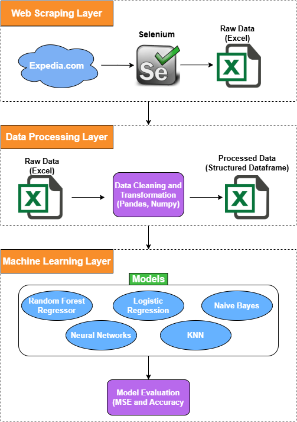
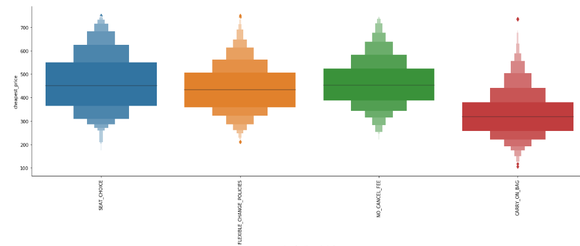
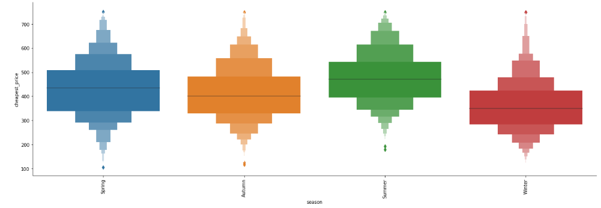
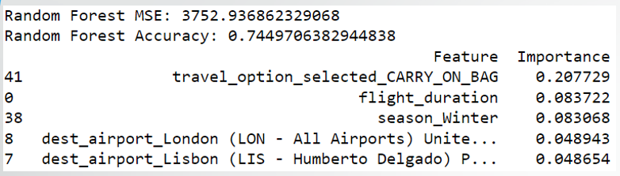
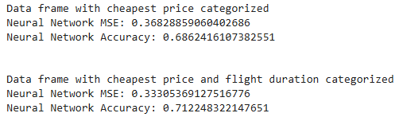

# Flight Price Factorization

## Table of Contents
* [General Info](#general-info)
* [Architecture](#architecture)
* [Features](#features)
* [Results](#results)
* [Technologies](#technologies)

## General Info
This project investigates whether it is possible to predict cheap flights by analyzing flight data and identifying the various attributes that impact the cost of a flight. The goal is to leverage machine learning techniques to build models that identify the most significant factors contributing to flight prices based on various attributes. This projects utilizes many techniques, such as:
* Data Driven Insights: Analyzing flight data to extract meaningful trends and correlations.
* Feature Engineering: Transforming raw flight information into features relevent to price prediction.
* AI-Powered Insights: Using advanced machine learning models to identify key factors influencing flight costs.
* Automation with Selenium: Automated a system that simulates a person selecting their desired flight to fetch data directly from expedia.com, streamlining the data collection process.

This project combines data analysis, machine learning, andweb automation to deliver a robust solution for forecasting flight prices. It demonstrates a strong understanding of end-to-end AI model development, from data collection to prediction, making it applicable to real-world scenarios in travel and e-commerce. 

## Architecture

## Features
1. Crawling and Scraping:
   * Automated a system using Selenium to simulate a user selecting flights and extracting real-time data directly from websites.
   * Ensured efficient and accurate scrapng of flight-related data, forming the basis for downstream analysis.
2. Data Loading:
   * Loading raw flight data from an [Excel file flight_data.xlsx](docs/flight_data.xlsx) into a Pandas DataFrame for processing and analysis.
3. Data Cleaning:
   * Duplicate Rows: Identified and removed duplicate rows in the DataFrame.
   * Outlier Detection: Used configurable ranges to filter out invalid or irrelevant data.
4. Exploratory Data Analysis:
   * Visualized data trends, feature distributions, and correlations using Matplotlib.
   * Identified anomalies and patterns in flight prices and other features.
5. Feature Engineering:
   * Transformed numerical features (e.g., cheapest_price and flight_duration) into categorical ranges.
   * Applied one-hot encoding to categorical variables for machine learning compatibility.
6. Machine Learning Models:
   * Trained, evaluated, and compared multiple models: Random Forest Regressor, Multinomial Naive Bayes, Neural Networks, Logistic Regression, K-Nearest Neighbors.
   * Implemented feature scaling and data transformation as required for specific models.
7. Metrics for Model Evaluation:
   * Evaluated models using Mean Squared Error (MSE) and Accuracy.
   * Analyzed feature importance to enhance model interpretability.
  
## Results
Each model was built on three different versions of the data frame to compare each model's accuracy. 
  1. The first data frame contains the flight prices and durations which are represented in numeric values, trying to solve a regression problem.
  2. In the second dataframe, we converted the flight prices to five different categories. This was used to solve a clasification problem.
  3. In the third dataframe we categorized the flight durations in addition to the flight prices categorization, also used to solve a classification problem.
Each model will calculate the MSE and the model's accuracy.

### Random Forest Model:
  * The Random Forest gives insight to feature importance. This model gave the highest accuracy (74%) on the first data frame. It showed that the Winter is the cheapest season to fly and adding carry on bags/ not adding carry on bags affects the price.
    
  
  
  

### Neural Network:
* The Neural Network model gave the best accuracy for the second and third data frames (69% and 70%).
  
  

## Technologies
* Python
* Automation Tool: Selenium
* Libraries:
  * Data Manipulation: Pandas, Numpy
  * Data Visualization: Matplotlip
  * Machine Learning: Scikit-learn
* IDE: Jupyter Notebook

 
